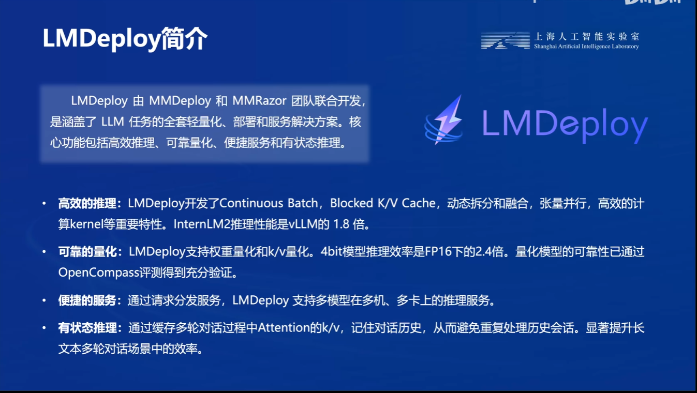

# InternLM2实战营第二期

## 第五节课 《LMDeploy 量化部署 LLM 实践》
官网地址：[书生·浦语官网](https://internlm.intern-ai.org.cn/)  
课程录播视频链接地址：[LMDeploy 量化部署 LLM 实践_bilibili](https://www.bilibili.com/video/BV1tr421x75B/)   


### 1.视频笔记

#### 大模型部署的背景：

模型部署到服务器还是移动端等，牵涉到不同的服务器端就要考虑计算资源是否足够，所以部署阶段，我们要考虑实际的计算资源去部署模型推理。


##### 大模型部署有几个痛点：

- **计算量巨大**
- **内存开销大**
- **访存瓶颈**
- **动态请求**


右边是OpenAI团队在Scaling laws这篇论文中提出来一个关于大模型前向推理所需计算公式。（注意这里只计算前向推理过程，并不是训练过程），右下方是预估计算量，20B的模型每生成一个token就要进行406亿次浮点运算，假设我们生成一个128token的回答，那么就需要5.2万亿左右的浮点运算。


如果想要GPU的利用率高的话，我们无法去预测模型生成的长度的，这也是为什么大模型的tensor的尺寸要求是固定的长度，因为如果有的长有的短，就会造成，同时去推理的时候，有的回答就比较长，有的就比较短，短回答的那个请求就会去等待长回答的那个请求，就会造成GPU资源利用率不足。


#### 常用模型部署方法

模型剪枝


知识蒸馏


模型量化


#### LMDeploy简介




支持多模态模型：


LMDeploy支持的模型列表：


### 2.接下来实战部分

**首先分享实战的官方指导文档：**[实战文档](https://github.com/InternLM/Tutorial/tree/camp2/lmdeploy)

#### 2.1环境安装（这一期我们不在JupyterLab实践，我们在terminal终端执行哈）


```
pip install lmdeploy[all]==0.3.0
```


安装可能有点慢，老规矩去看看指导视频吧


这里小伙伴们应该不会疑惑吧？我们现在进入的开发机“左上角”第一个代表VScode图标的终端，根据指导文档应该就清楚了，在空白处单击鼠标右键打开Tenrminal终端，我们需要使用`touch /root/pipeline_transformer.py`指令创建一个py文件，然后将加载InternLM2-chat-1_8b模型的代码Ctrl +V进去（代码请移步官方文档获取），然后保存这个py文件，回到终端，激活lmdeploy环境。运行该代码测试一下。效果如下：


通用使用LMDeploy与模型进行对话的通用命令格式为：

```python
lmdeploy chat [HF格式模型路径/TurboMind格式模型路径]
```
LMdeploy启动模型命令

```python
lmdeploy chat /root/internlm2-chat-1_8b
```


说实话LMDeploy去运行1.8B模型，真的输出快很多，很直观的能感受输出的速度。

有关LMDeploy的chat功能的更多参数可通过-h命令查看。

```
lmdeploy chat -h
```
### 3.LMDeploy模型量化(lite)

本部分内容主要介绍如何对模型进行量化。主要包括 KV8量化和W4A16量化。总的来说，量化是一种以参数或计算中间结果精度下降换空间节省（以及同时带来的性能提升）的策略。

正式介绍 LMDeploy 量化方案前，需要先介绍两个概念：

- 计算密集（compute-bound）: 指推理过程中，绝大部分时间消耗在数值计算上；针对计算密集型场景，可以通过使用更快的硬件计算单元来提升计算速度。
- 访存密集（memory-bound）: 指推理过程中，绝大部分时间消耗在数据读取上；针对访存密集型场景，一般通过减少访存次数、提高计算访存比或降低访存量来优化。

常见的 LLM 模型由于 Decoder Only 架构的特性，实际推理时大多数的时间都消耗在了逐 Token 生成阶段（Decoding 阶段），是典型的访存密集型场景。

那么，如何优化 LLM 模型推理中的访存密集问题呢？ 我们可以使用**KV8量化**和**W4A16**量化。KV8量化是指将逐 Token（Decoding）生成过程中的上下文 K 和 V 中间结果进行 INT8 量化（计算时再反量化），以降低生成过程中的显存占用。W4A16 量化，将 FP16 的模型权重量化为 INT4，Kernel 计算时，访存量直接降为 FP16 模型的 1/4，大幅降低了访存成本。Weight Only 是指仅量化权重，数值计算依然采用 FP16（需要将 INT4 权重反量化）。

#### 3.1 设置最大KV Cache缓存大小

KV Cache是一种缓存技术，通过存储键值对的形式来复用计算结果，以达到提高性能和降低内存消耗的目的。在大规模训练和推理中，KV Cache可以显著减少重复计算量，从而提升模型的推理速度。理想情况下，KV Cache全部存储于显存，以加快访存速度。当显存空间不足时，也可以将KV Cache放在内存，通过缓存管理器控制将当前需要使用的数据放入显存。

模型在运行时，占用的显存可大致分为三部分：模型参数本身占用的显存、KV Cache占用的显存，以及中间运算结果占用的显存。LMDeploy的KV Cache管理器可以通过设置`--cache-max-entry-count`参数，控制KV缓存**占用剩余显存**的最大比例。默认的比例为0.8。

下面通过几个例子，来看一下调整`--cache-max-entry-count`参数的效果。首先保持不加该参数（默认0.8），运行1.8B模型。

```
lmdeploy chat /root/internlm2-chat-1_8b
```


与模型对话，查看右上角资源监视器中的显存占用情况。

此时显存占用34064MB，然后改变`--cache-max-entry-count`参数，设为0.5。

```
lmdeploy chat /root/internlm2-chat-1_8b --cache-max-entry-count 0.5
```


与模型对话，再次查看右上角资源监视器中的显存占用情况。

此时显示是23024MB，**是不是明显变低了**。

下面来一波“极限”，把`--cache-max-entry-count`参数设置为0.01，约等于禁止KV Cache占用显存。

```
lmdeploy chat /root/internlm2-chat-1_8b --cache-max-entry-count 0.01
```


然后与模型对话，可以看到，此时显存占用仅为4880MB，代价是会降低模型推理速度。

#### 3.2 使用W4A16量化

LMDeploy使用AWQ算法，实现模型4bit权重量化。推理引擎TurboMind提供了非常高效的4bit推理cuda kernel，性能是FP16的2.4倍以上。它支持以下NVIDIA显卡：

- 图灵架构（sm75）：20系列、T4
- 安培架构（sm80,sm86）：30系列、A10、A16、A30、A100
- Ada Lovelace架构（sm90）：40 系列

运行前，首先安装一个依赖库。

```
pip install einops==0.7.0
```


仅需执行一条命令，就可以完成模型量化工作。

```
lmdeploy lite auto_awq \
   /root/internlm2-chat-1_8b \
  --calib-dataset 'ptb' \
  --calib-samples 128 \
  --calib-seqlen 1024 \
  --w-bits 4 \
  --w-group-size 128 \
  --work-dir /root/internlm2-chat-1_8b-4bit
```

量化后：


运行时间较长，请耐心等待。量化工作结束后，新的HF模型被保存到`internlm2-chat-1_8b-4bit`目录。下面使用Chat功能运行W4A16量化后的模型。

```
lmdeploy chat /root/internlm2-chat-1_8b-4bit --model-format awq
```

显存占用显示：


为了更加明显体会到W4A16的作用，我们将KV Cache比例再次调为0.01，查看显存占用情况。

```
lmdeploy chat /root/internlm2-chat-1_8b-4bit --model-format awq --cache-max-entry-count 0.01
```

显存显示：


可以看到，显存占用变为xxx，明显降低。

**拓展内容**：有关LMDeploy的lite功能的更多参数可通过-h命令查看。

```python
lmdeploy lite -h
```

#### 4.LMDeploy服务(serve)

在第二章和第三章，我们都是在本地直接推理大模型，这种方式成为本地部署。在生产环境下，我们有时会将大模型封装为API接口服务，供客户端访问。

我们来看下面一张架构图：


我们把从架构上把整个服务流程分成下面几个模块。

- 模型推理/服务。主要提供模型本身的推理，一般来说可以和具体业务解耦，专注模型推理本身性能的优化。可以以模块、API等多种方式提供。

- API Server。中间协议层，把后端推理/服务通过HTTP，gRPC或其他形式的接口，供前端调用。
- Client。可以理解为前端，与用户交互的地方。通过通过网页端/命令行去调用API接口，获取模型推理/服务。

值得说明的是，以上的划分是一个相对完整的模型，但在实际中这并不是绝对的。比如可以把“模型推理”和“API Server”合并，有的甚至是三个流程打包在一起提供服务。

##### 4.1 启动API服务器

通过以下命令启动API服务器，推理internlm2-chat-1_8b模型：

```python
lmdeploy serve api_server \
    /root/internlm2-chat-1_8b \
    --model-format hf \
    --quant-policy 0 \
    --server-name 0.0.0.0 \
    --server-port 23333 \
    --tp 1
```

其中，**model-format、quant-policy**这些参数是与第三章中量化推理模型一致的；s**erver-name**和**server-port**表示API服务器的服务IP与服务端口；tp参数表示并行数量（GPU数量）。


**----下面步骤是查看参数及其使用方法的，记住请勿关闭上面API服务器----**

通过运行以上指令，我们成功启动了API服务器，请勿关闭该窗口，后面我们要新建客户端连接该服务。

可以通过运行一下指令，查看更多参数及使用方法：

```python
lmdeploy serve api_server -h
```

你也可以直接打开`http://{host}:23333`查看接口的具体使用说明，如下图所示。）

**----我们先在本地打开cmd做一个ssh转发，然后使用上面地址查看FastAPi接口的具体说明----**

注意，这一步由于Server在远程服务器上，所以本地需要做一下ssh转发才能直接访问。在你本地打开一个cmd窗口，输入命令如下：

```
ssh -CNg -L 23333:127.0.0.1:23333 root@ssh.intern-ai.org.cn -p 你的ssh端口号
```


ssh 端口号就是下面图片里的 34656，请替换为你自己的。


##### 4.2 命令行客户端连接API服务器

前面我们新开了一个API服务器，接下来我们在开发机环境中VScode新建一个命令行客户端去连接API服务器，之前的API服务器窗口不要关闭。然后还是先激活conda中的lmdeploy环境。然后直接运行即可。

```python
lmdeploy serve api_client http://localhost:23333
```

运行后，就可以直接和模型对话了。


我们现在使用的架构和流程是这样的：


##### 4.3 网页客户端连接API服务器

**关闭刚刚的VSCode终端，但服务器端的终端不要关闭。**

新建一个VSCode终端，激活conda环境。

```
conda activate lmdeploy
```


使用Gradio作为前端，启动网页客户端。

```
lmdeploy serve gradio http://localhost:23333 \
    --server-name 0.0.0.0 \
    --server-port 6006
```


运行命令后，网页客户端启动。在电脑本地新建一个cmd终端，新开一个转发端口：

```
ssh -CNg -L 6006:127.0.0.1:6006 root@ssh.intern-ai.org.cn -p <你的ssh端口号>
```

打开浏览器，访问地址`http://127.0.0.1:6006`


然后就可以与模型进行对话了！

现在你使用的架构是这样的：

[](https://github.com/InternLM/Tutorial/blob/camp2/lmdeploy/imgs/4.3_3.jpg)


一直到这一步，我们就已经完成了网页客户端连接API服务器和大模型对话啦，不得不承认LMDeploy部署方式模型输出是真的很快，你们可以自己去尝试让模型输出较长文本的输出测试下速度。


#### 5.Python代码集成

在开发项目时，有时我们需要将大模型推理集成到Python代码里面。

##### 5.1 Python代码集成运行1.8B模型

首先激活conda环境。

```python
conda activate lmdeploy
```


新建Python源代码文件`pipeline.py`。

```python
touch /root/pipeline.py
```


打开`pipeline.py`，填入以下内容。

```python
from lmdeploy import pipeline

pipe = pipeline('/root/internlm2-chat-1_8b')
response = pipe(['Hi, pls intro yourself', '上海是'])
print(response)
```


> **代码解读**：\
>
> - 第1行，引入lmdeploy的pipeline模块 \
> - 第3行，从目录“./internlm2-chat-1_8b”加载HF模型 \
> - 第4行，运行pipeline，这里采用了批处理的方式，用一个列表包含两个输入，lmdeploy同时推理两个输入，产生两个输出结果，结果返回给response \
> - 第5行，输出response

保存后运行代码文件：

```
python /root/pipeline.py
```


##### 5.2 向TurboMind后端传递参数

在第3章，我们通过向lmdeploy传递附加参数，实现模型的量化推理，及设置KV Cache最大占用比例。在Python代码中，可以通过创建TurbomindEngineConfig，向lmdeploy传递参数。

以设置KV Cache占用比例为例，新建python文件`pipeline_kv.py`。

```python
touch /root/pipeline_kv.py
```


打开`pipeline_kv.py`，填入如下内容：

```python
from lmdeploy import pipeline, TurbomindEngineConfig

# 调低 k/v cache内存占比调整为总显存的 20%
backend_config = TurbomindEngineConfig(cache_max_entry_count=0.2)

pipe = pipeline('/root/internlm2-chat-1_8b',
                backend_config=backend_config)
response = pipe(['Hi, pls intro yourself', '上海是'])
print(response)
```


保存后运行python代码：

```python
python /root/pipeline_kv.py
```


得到输出结果：


#### 6.拓展部分

##### 6.1 使用LMDeploy运行视觉多模态大模型llava

最新版本的LMDeploy支持了llava多模态模型，下面演示使用pipeline推理`llava-v1.6-7b`。**注意，运行本pipeline最低需要30%的InternStudio开发机，请完成基础作业后向助教申请权限。**

首先激活conda环境。

```python
conda activate lmdeploy
```


安装llava依赖库。

```python
pip install git+https://github.com/haotian-liu/LLaVA.git@4e2277a060da264c4f21b364c867cc622c945874
```


新建一个python文件，比如`pipeline_llava.py`。

```python
touch /root/pipeline_llava.py
```

打开`pipeline_llava.py`，填入内容如下：

```python
from lmdeploy.vl import load_image
from lmdeploy import pipeline, TurbomindEngineConfig


backend_config = TurbomindEngineConfig(session_len=8192) # 图片分辨率较高时请调高session_len
# pipe = pipeline('liuhaotian/llava-v1.6-vicuna-7b', backend_config=backend_config) 非开发机运行此命令
pipe = pipeline('/share/new_models/liuhaotian/llava-v1.6-vicuna-7b', backend_config=backend_config)

image = load_image('https://raw.githubusercontent.com/open-mmlab/mmdeploy/main/tests/data/tiger.jpeg')
response = pipe(('describe this image', image))
print(response)
```


> **代码解读**： \
>
> - 第1行引入用于载入图片的load_image函数，第2行引入了lmdeploy的pipeline模块， \
> - 第5行创建了pipeline实例 \
> - 第7行从github下载了一张关于老虎的图片，如下：
>   [](https://github.com/InternLM/Tutorial/blob/camp2/lmdeploy/imgs/6.1_1.jpg) \
> - 第8行运行pipeline，输入提示词“describe this image”，和图片，结果返回至response \
> - 第9行输出response

保存后运行pipeline。

```python
python /root/pipeline_llava.py
```
**如果这里显示out of memory，请注意你的开发机申请大小30%
以上，并且检查当前显卡下是否还有上一个项目正在运行，kill掉终端即可继续执行**

得到输出结果：


> **大意（来自百度翻译）**：一只老虎躺在草地上。老虎面对镜头，头微微向一侧倾斜，给人一种好奇或专注的表情。老虎在较浅的背景上有一种独特的深色条纹图案，这是该物种的特征。皮毛是橙色和黑色的混合，深色的条纹垂直向下延伸，浅色的皮毛出现在胸部和腹部。老虎的眼睛睁开，警觉，耳朵竖起，这表明它对周围环境很关注。背景是模糊的绿色区域，表明照片是在户外拍摄的，可能是在自然栖息地或野生动物保护区。这张图片是特写，聚焦于老虎的头部和上身，突出了老虎的特征和皮毛的纹理。照片中没有可见的文字或其他物体，照片的风格是自然的野生动物拍摄，旨在捕捉环境中的动物。

由于官方的Llava模型对中文支持性不好，因此如果使用中文提示词，可能会得到出乎意料的结果，比如将提示词改为“请描述一下这张图片”，你可能会得到类似《印度鳄鱼》的回复。


我们也可以通过Gradio来运行llava模型。新建python文件`gradio_llava.py`。

```python
touch /root/gradio_llava.py
```

打开文件，填入以下内容：

```python
import gradio as gr
from lmdeploy import pipeline, TurbomindEngineConfig


backend_config = TurbomindEngineConfig(session_len=8192) # 图片分辨率较高时请调高session_len
# pipe = pipeline('liuhaotian/llava-v1.6-vicuna-7b', backend_config=backend_config) 非开发机运行此命令
pipe = pipeline('/share/new_models/liuhaotian/llava-v1.6-vicuna-7b', backend_config=backend_config)

def model(image, text):
    if image is None:
        return [(text, "请上传一张图片。")]
    else:
        response = pipe((text, image)).text
        return [(text, response)]

demo = gr.Interface(fn=model, inputs=[gr.Image(type="pil"), gr.Textbox()], outputs=gr.Chatbot())
demo.launch()   
```


运行python程序。

```python
python /root/gradio_llava.py
```


通过ssh转发一下7860端口。

```python
ssh -CNg -L 7860:127.0.0.1:7860 root@ssh.intern-ai.org.cn -p <你的ssh端口>
```
通过浏览器访问`http://127.0.0.1:7860`。


然后就可以使用啦~

##### 6.2 使用LMDeploy运行第三方大模型

LMDeploy不仅支持运行InternLM系列大模型，还支持其他第三方大模型。支持的模型列表如下：

| Model              | Size       |
| ------------------ | ---------- |
| Llama              | 7B - 65B   |
| Llama2             | 7B - 70B   |
| InternLM           | 7B - 20B   |
| InternLM2          | 7B - 20B   |
| InternLM-XComposer | 7B         |
| QWen               | 7B - 72B   |
| QWen-VL            | 7B         |
| QWen1.5            | 0.5B - 72B |
| QWen1.5-MoE        | A2.7B      |
| Baichuan           | 7B - 13B   |
| Baichuan2          | 7B - 13B   |
| Code Llama         | 7B - 34B   |
| ChatGLM2           | 6B         |
| Falcon             | 7B - 180B  |
| YI                 | 6B - 34B   |
| Mistral            | 7B         |
| DeepSeek-MoE       | 16B        |
| DeepSeek-VL        | 7B         |
| Mixtral            | 8x7B       |
| Gemma              | 2B-7B      |
| Dbrx               | 132B       |

可以从Modelscope，OpenXLab下载相应的HF模型，下载好HF模型，下面的步骤就和使用LMDeploy运行InternLM2一样啦~

##### 6.3 定量比较LMDeploy与Transformer库的推理速度差异

为了直观感受LMDeploy与Transformer库推理速度的差异，让我们来编写一个速度测试脚本。测试环境是30%的InternStudio开发机。

先来测试一波Transformer库推理Internlm2-chat-1.8b的速度，新建python文件，命名为`benchmark_transformer.py`，填入以下内容：

```python
import torch
import datetime
from transformers import AutoTokenizer, AutoModelForCausalLM

tokenizer = AutoTokenizer.from_pretrained("/root/internlm2-chat-1_8b", trust_remote_code=True)

# Set `torch_dtype=torch.float16` to load model in float16, otherwise it will be loaded as float32 and cause OOM Error.
model = AutoModelForCausalLM.from_pretrained("/root/internlm2-chat-1_8b", torch_dtype=torch.float16, trust_remote_code=True).cuda()
model = model.eval()

# warmup
inp = "hello"
for i in range(5):
    print("Warm up...[{}/5]".format(i+1))
    response, history = model.chat(tokenizer, inp, history=[])

# test speed
inp = "请介绍一下你自己。"
times = 10
total_words = 0
start_time = datetime.datetime.now()
for i in range(times):
    response, history = model.chat(tokenizer, inp, history=history)
    total_words += len(response)
end_time = datetime.datetime.now()

delta_time = end_time - start_time
delta_time = delta_time.seconds + delta_time.microseconds / 1000000.0
speed = total_words / delta_time
print("Speed: {:.3f} words/s".format(speed))
```


运行python脚本：

```python
python benchmark_transformer.py
```

得到运行结果：


可以看到，Transformer库的推理速度约为83.757 words/s，注意单位是words/s，不是token/s，word和token在数量上可以近似认为成线性关系。

下面来测试一下LMDeploy的推理速度，新建python文件`benchmark_lmdeploy.py`，填入以下内容：

```python
import datetime
from lmdeploy import pipeline

pipe = pipeline('/root/internlm2-chat-1_8b')

# warmup
inp = "hello"
for i in range(5):
    print("Warm up...[{}/5]".format(i+1))
    response = pipe([inp])

# test speed
inp = "请介绍一下你自己。"
times = 10
total_words = 0
start_time = datetime.datetime.now()
for i in range(times):
    response = pipe([inp])
    total_words += len(response[0].text)
end_time = datetime.datetime.now()

delta_time = end_time - start_time
delta_time = delta_time.seconds + delta_time.microseconds / 1000000.0
speed = total_words / delta_time
print("Speed: {:.3f} words/s".format(speed))
```


运行脚本：

```python
python benchmark_lmdeploy.py
```


得到运行结果：


可以看到，LMDeploy的推理速度约为378.238 words/s，约等于是Transformer库的5倍。

### 总结

这一节内容其实比较简单，需要理解的知识点都是LMdeploy部署有关，更多的是希望同学们能够感受到LMdeploy部署的操作便捷性和输出的性能。